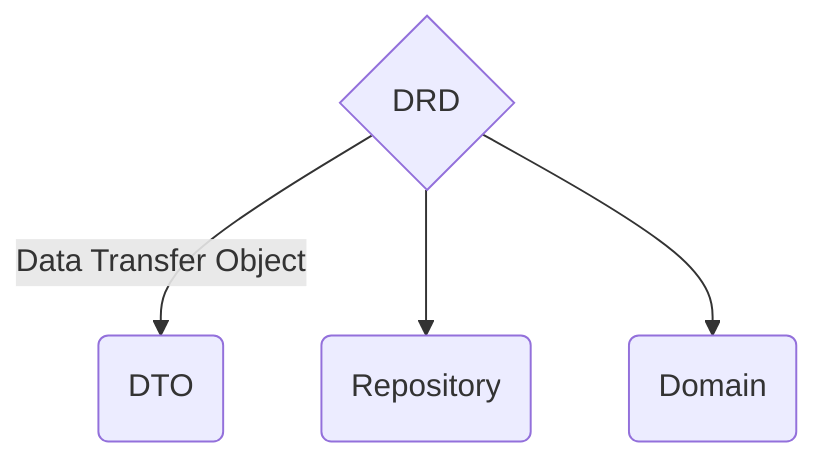
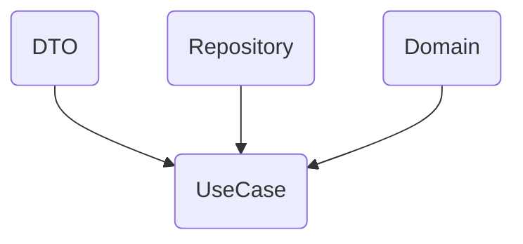

# DRD Architecture - Angular example

[LIVE DEMO](https://quak.com.pl/drd-architecture/angular-example)

## Project - DRD

QUAK: *"DRD stands for DTO, Repository, Domain. It is a frontend software architecture that separates the business logic from the presentation layer - so called use cases. It is a layered architecture that is based on the principles of Domain Driven Design (DDD)."*

This is an example of Angular application using the DRD Architecture. It's is fully working and can be used as a starting point for your own project.

### Architecture graph

#### Core - DRD

#### Use Case - Views

### Dependencies

This project was generated with [Angular CLI](https://github.com/angular/angular-cli) version 16.1.1.

Installed only the following packages:

- "@quak.lib/qstore": "^1.0.8" - for state management (Store, Action, ActionWith)

DEV dependency:

- "prettier": "2.8.8" - for code formatting

## Development server

Run `npm install` to install dependencies.

Run `npm run start` for a dev server. Navigate to `http://localhost:4200/`.

## Developing

Start in the root of your project (/drd-angular).

### Generating boilerplate

Generate users view module boilerplate:

Run `ng g module /views/users --route=users --module=app.module`.

Run `ng g module /views/users/user-search --route=user-search --module=users.module`.

Run `ng g module /views/users/user-profile --route=user-profile --module=users.module`.

### Prettier

Run `npm run prettier` to format all files or to check all files `npm run prettier:check`.

### Build app

Use `ng build` to build the project. The build artifacts will be stored in the `dist/` directory.
